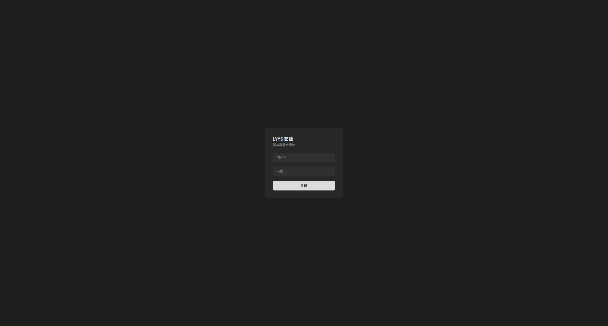
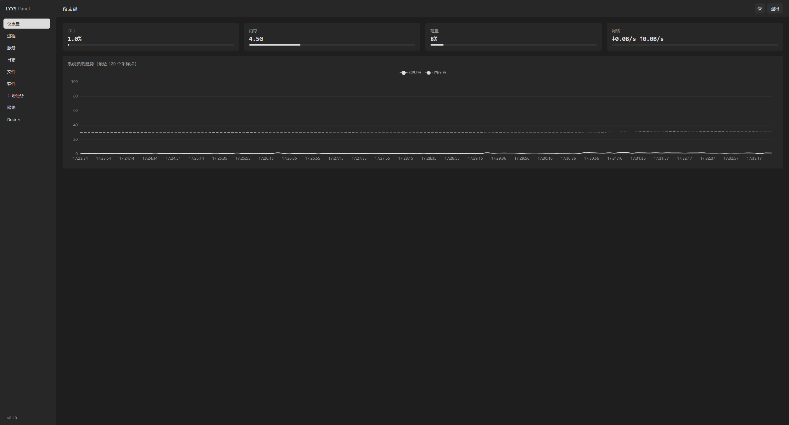

# LYYS Panel

轻量级 Linux 服务器运维面板。单个 Rust 二进制内含前端构建产物，**部署时服务器无需 Node 环境**。

[](https://www.gnu.org/licenses/gpl-3.0.txt)
[](https://www.rust-lang.org/)
[](https://vuejs.org/)

## 简介

LYYS Panel 面向单台 Linux 服务器的日常运维，把系统监控、进程与服务管理、日志、文件、软件包、计划任务、网络与 Docker 等操作收进一个 Web 界面。

整个产品编译为一个静态 Rust 二进制，前端构建产物在编译期打入其中，目标机器零运行时依赖——随构建机不同也不需要 Node 环境。适合受信内网自托管。

## 界面预览




## 功能特性

| 模块 | 说明 |
|---|---|
| 仪表盘 | CPU / 内存 / 磁盘 / 网络实时快照，历史趋势折线图 |
| 进程 | 进程列表查看与结束 |
| 服务 | systemd 服务查看、启动 / 停止 / 重启 |
| 日志 | journal 日志查询、日志文件列表与实时 tail |
| 文件 | 目录浏览、在线编辑、上传下载、新建 / 重命名 / 删除 |
| 软件 | 包列表、可升级查询、搜索、安装 / 卸载 / 升级（Debian 系 apt、Arch 系 pacman） |
| 计划任务 | crontab 增删改查 |
| 网络 | 网卡、路由、连接、DNS 查看 |
| Docker | 容器列表与启动 / 停止 / 重启 / 删除、容器日志、镜像拉取与删除、Compose 项目启停；未安装时页面上可直接安装 |

**亮点**

- 单二进制、零 Node 依赖，部署即拷即用
- 实时监控快照与历史趋势
- Docker 一键安装与容器 / 镜像 / Compose 管理
- 所有数据落本地 SQLite，无云端依赖

## 安全说明

面板能改文件、结束进程、装卸软件，且以 root 运行 —— 请务必理解以下几点：

- **登录限流**：同一「来源 IP + 用户名」连续登录失败会触发指数退避（1s、2s、4s…… 封顶 30s），
  触发期间返回 `429`。这是退避而非锁定，合法用户输错几次只会觉得变慢，不会被锁在门外。
  退避状态存于内存，重启即清空。
- **仍需注意**：面板默认明文 HTTP，对外暴露前请置于反向代理并启用 TLS；
  文件模块可访问整个文件系统，服务以 root 运行是管理 systemd / 进程所需 ——
  这两点决定了**只能在受信网络内使用**，不要暴露到公网。

## 技术栈

- **后端**：Rust · Axum 0.8 · Tokio · rusqlite（bundled，无外部 SQLite 依赖）· JWT + Argon2
- **前端**：Vue 3 · TypeScript · Vite 5 · Element Plus · Pinia · ECharts
- **前端嵌入**：`rust-embed` 编译期把 `frontend/dist` 打入二进制

## 快速开始

### 前置要求

- Rust stable（含 rustfmt / clippy，见 `backend/rust-toolchain.toml`）
- Node.js 20+ 与 npm

### 一条命令构建

> ⚠️ **必须先构建前端，再编译后端。**
> 后端用 `rust-embed` 在**编译期**读取 `frontend/dist`，该目录不存在会直接编译失败。
> `frontend/dist` 不纳入版本管理，所以 clone 后不能直接 `cargo build`。

```bash
./build.sh
```

产物：`backend/target/release/lyys-panel`

### 分步构建

```bash
# 1. 前端（必须先做）
cd frontend
npm install        # 首次安装依赖；需严格按 lockfile 复现时用 npm ci
npm run build

# 2. 后端
cd ../backend
cargo build --release
```

### 本地运行

```bash
PANEL_ADMIN_PASSWORD='你的强密码' ./backend/target/release/lyys-panel
```

默认监听 `127.0.0.1:3789`，浏览器打开 http://127.0.0.1:3789 ，账号 `admin`。

前端热重载开发（后端需另起一个实例）：

```bash
cd frontend && npm run dev
```

## 配置

### 环境变量

| 变量 | 默认值 | 说明 |
|---|---|---|
| `PANEL_ADDR` | `127.0.0.1:3789` | 监听地址。`0.0.0.0:3789` 表示所有网卡 |
| `PANEL_DB` | `data/panel.db` | SQLite 数据库路径 |
| `PANEL_ADMIN_PASSWORD` | 随机生成 | 首次启动创建管理员时使用，**仅第一次生效** |

未设置 `PANEL_ADMIN_PASSWORD` 时会生成随机密码并打印到日志。

## 部署(systemd)

以现有服务器配置为例，完整部署到 systemd：

### 1. 目录与产物

```bash
sudo mkdir -p /opt/lyys-panel /etc/lyys-panel /var/lib/lyys-panel
sudo cp backend/target/release/lyys-panel /opt/lyys-panel/
```

### 2. 环境文件（EnvironmentFile）

创建 `/etc/lyys-panel/panel.env`，变量见上表：

```bash
PANEL_ADDR=127.0.0.1:3789
PANEL_ADMIN_PASSWORD=你的强密码
```

### 3. systemd 单元

创建 `/etc/systemd/system/lyys-panel.service`：

```ini
[Unit]
Description=LYYS Server Panel
After=network.target

[Service]
Type=simple
ExecStart=/opt/lyys-panel/lyys-panel
EnvironmentFile=/etc/lyys-panel/panel.env
WorkingDirectory=/opt/lyys-panel
# 数据库放独立数据目录，避免污染程序目录
Environment=PANEL_DB=/var/lib/lyys-panel/panel.db
Restart=on-failure
RestartSec=3
# 面板需要管理系统服务/进程/日志，以 root 运行
User=root

[Install]
WantedBy=multi-user.target
```

### 4. 启用并启动

```bash
sudo systemctl daemon-reload
sudo systemctl enable --now lyys-panel
```

### 5. 反向代理（强烈建议）

面板默认明文 HTTP，对外暴露前置于 Nginx / Caddy 等反向代理并启用 TLS。

## 项目结构

```
lyys_panel/
├── backend/            Rust 后端
│   ├── src/
│   │   ├── main.rs         入口、配置、路由装配
│   │   ├── api.rs          HTTP 处理器与路由表
│   │   ├── auth.rs         登录、JWT、Argon2、管理员引导、登录退避
│   │   ├── db.rs           SQLite 连接池与建表
│   │   ├── embed.rs        内嵌前端资源服务（含 SPA 回退与缓存头）
│   │   ├── monitor.rs      系统指标采集
│   │   ├── files.rs        文件浏览 / 读写 / 上传下载
│   │   ├── distro.rs       发行版检测（仅支持 Debian / Arch 系，不支持则退出）
│   │   ├── packages.rs     软件包管理（apt / pacman 按家族分派）
│   │   ├── crontab.rs      计划任务
│   │   ├── network.rs      网络信息
│   │   ├── logs.rs         日志查询
│   │   ├── docker.rs       Docker 容器 / 镜像 / Compose（含一键安装）
│   │   ├── opservice.rs / rprocess.rs   systemd 服务与进程操作
│   │   └── ...
│   └── Cargo.toml
├── frontend/           Vue 3 前端
│   └── src/
│       ├── layout/AppLayout.vue   侧边栏 + 顶栏 + 内容区骨架
│       ├── views/                 各功能页面
│       ├── router/                路由与登录守卫
│       ├── stores/                主题等全局状态
│       ├── api/                   axios 封装与拦截器
│       └── styles/theme.css       Element Plus 变量覆盖（黑白主题）
├── scripts/            git 钩子与安装脚本（提交信息机械校验）
├── screenshots/        界面预览截图
└── build.sh            一键构建脚本
```

## 开发者约定

- **无边框设计**：所有 `--el-border-color*` 均为 `transparent`，层次靠背景色差表达。请勿添加实色边框。
- **全部圆角**：统一 6px，基准变量为 `theme.css` 中的 `--radius`。新增组件优先引用该变量。
- 主题为纯黑白灰，无彩色、无阴影。注意浏览器自动填充的输入框底色由浏览器绘制（暗色下是一层暗黄），不受面板变量控制。
- 按钮与输入框并排时不要给按钮写死高度（会变成正方形），也不要给文本域写死 `rows`；让容器 `align-items: stretch`，按钮跟随输入框高度。
- 圆角容器若内部子元素带背景（表头、hover 行、加载遮罩等），**必须配 `overflow: hidden`**，否则背景会填满四角、把圆角盖成直角。

## 贡献指南

- 完整贡献规范见 [`CONTRIBUTING.md`](CONTRIBUTING.md)（含提交信息格式，由 `commit-msg` 钩子机械执行）
- AI 在仓库内的 git 行为铁律见 `AGENTS.md`：禁止主动提交、提交信息必须先审批、禁止改写历史

## 已知限制与路线图

**安全**

- 面板默认明文 HTTP，对外暴露前建议置于反向代理并启用 TLS
- 文件模块可访问整个文件系统（不设根目录约束）—— 仅限受信网络内使用
- 登录限流基于内存，重启后清零；且未接入反向代理时按来源 IP 计数，
  若置于 NAT 之后，同一出口的多个用户会共享退避额度

**功能与工程**

- 外部命令调用无超时（Docker 请求除外，见其实现）；apt 同步操作无并发锁
- Docker 的 Compose 项目在「独立 `docker-compose` 命令」这一路径下，会以容器 label 反推项目，
  容器被全部删除的项目不可见
- `frontend/package.json` 声明了 `lint` / `format` 脚本，但仓库尚未提交对应的 ESLint / Prettier 配置，直接执行会失败
- 前后端均无自动化测试；无 CI
- 缺少「修改管理员密码」界面：遗忘密码需停服务删 `panel.db` 重建，**会丢失监控历史**

**已解决**

- ~~登录接口无失败限流~~ → 已实现指数退避（`auth::LoginThrottle`）

## License

本项目采用 [GPL-3.0](https://www.gnu.org/licenses/gpl-3.0.txt) 许可证。