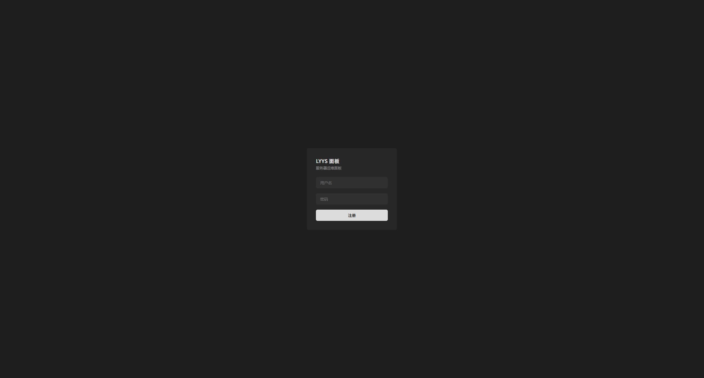
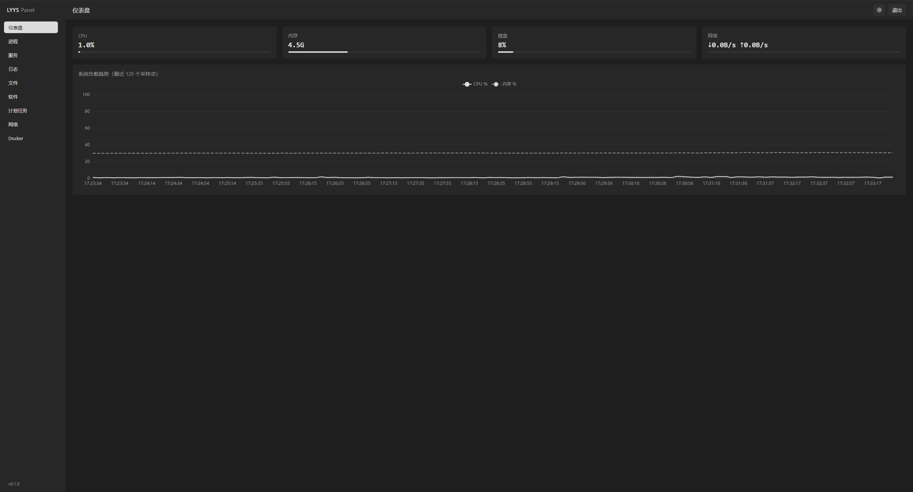

# LYYS Panel

轻量级 Linux 服务器运维面板。单个 Rust 二进制内含前端构建产物，**部署时服务器无需 Node 环境**。

[](https://www.gnu.org/licenses/gpl-3.0.txt)
[](https://www.rust-lang.org/)
[](https://vuejs.org/)

## 简介

LYYS Panel 面向单台 Linux 服务器的日常运维，把系统监控、进程与服务管理、日志、文件、软件包、计划任务、网络、Docker、AI 助手、备份恢复、自更新与告警等操作收进一个 Web 界面。

整个产品编译为一个静态 Rust 二进制，前端构建产物在编译期打入其中，目标机器零运行时依赖（连 Node 都不需要）。适合受信内网自托管。

## 界面预览




## 功能特性

| 模块 | 说明 |
|---|---|
| 仪表盘 | 14 张可配置卡片（CPU / 内存 / 交换区 / 磁盘 / 磁盘 I/O / 网络 / 负载 / 进程 / 分区 / 运行时长 / CPU 规格 / 系统），勾选、拖边缩放与布局均持久化；负载趋势折线图（可选时间窗） |
| 进程 | 进程列表查看与结束（列表全量拉取，页面内关键字过滤） |
| 服务 | systemd 服务查看、启动 / 停止 / 重启 / 重载 |
| 实例 | 容器与 systemd 服务的统一入口：状态与资源占用，直达日志（容器日志 / journal 单元）与进程，服务可启停 |
| 运维 | 磁盘 SMART 健康、unit 文件查看、容器日志流（实时 tail，可选尾部行数） |
| 日志 | journal 日志查询、日志文件列表与实时 tail |
| 文件 | 目录浏览、在线编辑、上传下载、新建 / 重命名 / 删除、压缩与解压（tar / tar.gz / tar.bz2 / tar.xz / zip）、权限与属主修改 |
| 软件 | 包列表、可升级查询、搜索、安装 / 卸载 / 升级（Debian 系 apt、Arch 系 pacman） |
| 计划任务 | crontab 增删改查；systemd 定时器（OnCalendar 调度、可启停、立即执行、journald 执行日志） |
| 网络 | 网卡、路由、连接、DNS 查看 |
| 防火墙 | ufw / firewalld 状态与规则查看、放行 / 拒绝 / 删除规则、启用停用（仅 admin） |
| 任务 | 后台作业队列：安装 / 更新等长操作转后台执行，可离开页面，列表回看进度与输出尾部（每个作业保留最近 200 行），支持取消 |
| 在线会话 | 已登录用户的会话列表，可按会话强制下线 |
| Docker | 容器列表与启动 / 停止 / 重启 / 删除、容器日志、镜像拉取与删除、Compose 项目启停；未安装时页面上可直接安装 |
| AI 助手 | 流式对话（OpenAI 兼容上游，支持 Ollama 等本地模型），思考过程与工具调用按时间顺序呈现；内置面板只读工具与联网检索，配置可在设置页在线修改 |
| 备份 | 数据库快照列表 / 立即备份 / 下载 / 上传导入 / 删除 / 恢复（重启生效），备份目录与保留份数可配，每日自动备份 |
| 面板更新 | 检查 GitHub Release、按架构（x86_64 / aarch64）在线下载替换二进制、内网手动上传旁路 |
| 告警 | CPU / 内存 / 磁盘阈值规则（滞回防抖）、事件历史、钉钉 / 企业微信 / 飞书 / Telegram / 通用 webhook 通知（失败退避重试） |
| 账号 | 多用户 + RBAC（admin / operator / viewer，写操作按等级分派）、在线会话、操作审计日志 |
| 系统设置 | 仅管理员可改的服务端配置（AI 上游地址 / 密钥 / 模型）与界面预设 |

**亮点**

- 单二进制、零 Node 依赖，部署即拷即用
- 默认 HTTPS（自签证书自动生成，可挂正式证书）
- 实时监控快照与历史趋势（小时聚合 + 保留策略）
- 在线自更新（GitHub Release 下载 → 校验 → 原子替换 → 重启生效）
- AI 流式对话，支持接入本地 Ollama 模型
- 界面字体可自配：默认系统字体，设置页可上传自有字体文件（对所有设备生效）
- 所有数据落本地 SQLite，无云端依赖

## 安全说明

面板能改文件、结束进程、装卸软件，且以 root 运行 —— 请务必理解以下几点：

- **登录限流**：同一「来源 IP + 用户名」连续登录失败会触发指数退避（1s、2s、4s…… 封顶 30s），
  触发期间返回 `429`。这是退避而非锁定，合法用户输错几次只会觉得变慢，不会被锁在门外。
  退避记录存在数据库，重启后依然生效（最多保留 4096 条，距上次失败超过 300 秒重新计数）。
- **默认 HTTPS（自签证书）**：首次启动自动生成自签证书并以 HTTPS 提供服务（默认端口 3789），
  浏览器提示证书不受信任属自签的正常现象；可用 `PANEL_TLS=custom` 挂载 CA 签发的正式证书，
  也可 `PANEL_TLS=off` 回退纯 HTTP。
- **仍需注意**：文件模块可访问整个文件系统，服务以 root 运行是管理 systemd / 进程所需 ——
  这两点决定了**只能在受信网络内使用**，不要暴露到公网。

## 技术栈

- **后端**：Rust 2024 edition · Axum 0.8 · Tokio · rusqlite（bundled，无外部 SQLite 依赖）· JWT + Argon2 · rustls（TLS）
- **前端**：Vue 3 · TypeScript · Vite 5 · Element Plus · Pinia · ECharts
- **前端嵌入**：`rust-embed` 编译期把 `frontend/dist` 打入二进制

## 快速开始

### 一键安装（服务器部署，推荐）

在目标服务器上以 root 执行，脚本会自动识别 x86_64 / aarch64 并下载对应架构的
release 二进制（默认用 release 附带的 `.sha256` 校验），创建系统用户与目录、
生成 env 模板（默认 HTTPS 自签证书）和 systemd 单元、安装管理命令并启动服务：

```bash
curl -fsSL https://raw.githubusercontent.com/Zecheng-6114/lyys_panel/main/scripts/install.sh \
  | sudo bash -s -- [选项]
```

常用选项（也可先下载脚本再执行 `sudo bash install.sh --help`）：

```bash
sudo bash install.sh --version v1.10.0      # 指定 release 标签（默认查最新）
sudo bash install.sh --addr 0.0.0.0:3789    # 监听地址（脚本默认 0.0.0.0:3789）
sudo bash install.sh --port 9443            # 只改端口，等价 --addr 0.0.0.0:9443
sudo bash install.sh --no-tls               # 关闭 HTTPS，纯 HTTP
sudo bash install.sh --admin-password 'xxx' # 首次安装时直接设定管理员密码
sudo bash install.sh --package ./lyys-panel # 离线安装：用本地二进制，不联网
sudo bash install.sh --no-checksum          # 跳过 sha256 校验（不推荐）
sudo bash install.sh -h                     # 查看全部选项
```

同名环境变量可替代对应选项，便于非交互批量部署：`PANEL_VERSION` / `PANEL_ADDR` /
`PANEL_TLS` / `PANEL_ADMIN_PASSWORD` / `PANEL_INSTALL_DIR` / `PANEL_CONF_DIR` /
`PANEL_DATA_DIR` / `PANEL_PACKAGE`。

重复执行 install.sh 即为升级（覆盖二进制与 systemd 单元，不改动已有配置与数据）。

### 服务管理命令

安装脚本会同时装上 `lyys-panel-ctl`，日常运维不必再记 systemd 与配置文件路径：

```bash
lyys-panel-ctl status      # 服务状态与最近日志
lyys-panel-ctl restart     # 重启服务（start / stop 同理）
lyys-panel-ctl logs -f     # 跟随输出服务日志
lyys-panel-ctl user-info   # 访问地址、账号与初始密码文件位置
lyys-panel-ctl config      # 当前环境配置（密码字段打码）
lyys-panel-ctl help        # 全部命令
```

### 卸载

```bash
sudo bash uninstall.sh                     # 删配置目录与管理命令，保留数据与系统用户
sudo bash uninstall.sh --purge             # 连数据目录（数据库 / 证书 / 备份）与系统用户一起删
sudo bash uninstall.sh --keep-conf         # 保留 /etc/lyys-panel 配置目录
```

初始密码获取、证书警告等常见问题见下文 FAQ。

### 前置要求（从源码构建）

- Rust stable ≥ 1.85（后端使用 2024 edition；工具链含 rustfmt / clippy，见 `backend/rust-toolchain.toml`）
- Node.js 20+ 与 npm

### 一条命令构建

> ⚠️ **必须先构建前端，再编译后端。**
> 后端用 `rust-embed` 在**编译期**读取 `frontend/dist`，该目录不存在会直接编译失败。
> `frontend/dist` 不纳入版本管理，所以 clone 后不能直接 `cargo build`。

```bash
./build.sh
```

产物：`backend/target/release/lyys-panel`

### 分步构建

```bash
# 1. 前端（必须先做）
cd frontend
npm install        # 首次安装依赖；需严格按 lockfile 复现时用 npm ci
npm run build

# 2. 后端
cd ../backend
cargo build --release
```

### 本地运行

```bash
PANEL_ADMIN_PASSWORD='你的强密码' ./backend/target/release/lyys-panel
```

默认监听 `127.0.0.1:3789`，浏览器打开 http://127.0.0.1:3789 ，账号 `admin`。

前端热重载开发（后端需另起一个实例）：

```bash
cd frontend && npm run dev
```

## 配置

### 环境变量

| 变量 | 默认值 | 说明 |
|---|---|---|
| `PANEL_ADDR` | `127.0.0.1:3789` | 监听地址。`0.0.0.0:3789` 表示所有网卡 |
| `PANEL_DB` | `data/panel.db` | SQLite 数据库路径 |
| `PANEL_ADMIN_PASSWORD` | 随机生成 | 首次启动创建管理员时使用，**仅第一次生效** |
| `PANEL_DATA_DIR` | `data` | 面板数据目录（数据库默认另由 `PANEL_DB` 指定；自签证书在 `<目录>/tls/`）。文件管理 API 屏蔽该目录 |
| `PANEL_TLS` | `auto` | `auto`=首启生成自签证书启用 HTTPS；`custom`+`PANEL_TLS_CERT`/`PANEL_TLS_KEY`=已有证书；`off`=纯 HTTP |
| `PANEL_HTTP_PORT` | 未设置 | 设置后额外监听一个纯 HTTP 端口，301 跳转到 HTTPS |
| `PANEL_JWT_SECRET` | 自动生成 | JWT 签名密钥（≥32 字节）；未设置时使用数据目录下的 0600 密钥文件 |
| `PANEL_TRUST_PROXY` | 未设置 | 设为 `1` / `true` / `yes` 时按 `X-Forwarded-For` 最左值判定来源 IP（面板须位于可信反代之后，且反代对每个请求都覆盖而非追加该头）；未设时按连接地址判定。取值只在首次调用时读一次 |
| `AI_API_BASE` | `https://api.openai.com/v1` | AI 上游地址（OpenAI 兼容，Ollama 为 `http://<host>:11434/v1`）。设置页配置优先于环境变量 |
| `AI_API_KEY` | 无 | AI 上游密钥；未配置时 AI 功能拒绝请求。设置页配置优先 |
| `AI_MODEL` | `gpt-4o-mini` | AI 对话模型名。设置页配置优先 |
| `AI_SEARCH_BASE` | 无 | AI 联网搜索地址（自建 SearxNG 等，需开启 JSON 输出）。留空时走内置的 Bing / DuckDuckGo 通道。设置页配置优先 |

未设置 `PANEL_ADMIN_PASSWORD` 时会生成随机密码，写入数据目录下的
`initial_admin_password.txt`（权限 0600，明文**不打印到日志**），首次登录成功后自动删除（详见下方 FAQ）。

## 部署(systemd)

> 服务器部署推荐直接使用 `scripts/install.sh`（见[快速开始](#快速开始)），
> 以下为手动部署的完整步骤。

以现有服务器配置为例，完整部署到 systemd：

### 1. 目录与产物

```bash
sudo mkdir -p /opt/lyys-panel /etc/lyys-panel /var/lib/lyys-panel
sudo cp backend/target/release/lyys-panel /opt/lyys-panel/
```

### 2. 环境文件（EnvironmentFile）

创建 `/etc/lyys-panel/panel.env`，变量见上表：

```bash
PANEL_ADDR=127.0.0.1:3789
PANEL_ADMIN_PASSWORD=你的强密码
```

### 3. systemd 单元

创建 `/etc/systemd/system/lyys-panel.service`：

```ini
[Unit]
Description=LYYS Server Panel
Wants=network-online.target
After=network-online.target

[Service]
Type=simple
ExecStart=/opt/lyys-panel/lyys-panel
EnvironmentFile=/etc/lyys-panel/panel.env
WorkingDirectory=/opt/lyys-panel
# 数据库放独立数据目录，避免污染程序目录；面板需管理系统服务 / 进程 / 日志，以 root 运行
Environment=PANEL_DB=/var/lib/lyys-panel/panel.db
User=root
Restart=on-failure
RestartSec=3
LimitNOFILE=65535

[Install]
WantedBy=multi-user.target
```

（等效于 `scripts/install.sh` 写出的单元；手动部署时照抄即可。）

### 4. 启用并启动

```bash
sudo systemctl daemon-reload
sudo systemctl enable --now lyys-panel
```

### 5. 证书与反代（可选）

面板默认以自签证书提供 HTTPS；如需正式证书，设置 `PANEL_TLS=custom` 并指定
`PANEL_TLS_CERT` / `PANEL_TLS_KEY`，或前置 Nginx / Caddy 反向代理统一管理 TLS。

## FAQ

**浏览器提示「证书不受信任」？**

默认 HTTPS 使用首启自动生成的自签证书（位于 `PANEL_DATA_DIR` 下的 `tls/`
目录），浏览器警告属正常现象，受信内网可点击继续访问。消除警告的方式：
①挂 CA 签发的证书（`PANEL_TLS=custom` + `PANEL_TLS_CERT` / `PANEL_TLS_KEY`）；
②前置已有域名与证书的反向代理。

**初始 admin 密码在哪？**

安装时用 `--admin-password` 指定过的话，直接用它登录即可。未设置
`PANEL_ADMIN_PASSWORD` 时，首次启动会生成随机密码写入数据目录下的
`initial_admin_password.txt`（权限 0600，**不打印到日志**），首次登录成功后
该文件自动删除。通过 install.sh 安装时位于 `/var/lib/lyys-panel/`：

```bash
cat /var/lib/lyys-panel/initial_admin_password.txt
```

懒得记路径可以用 `sudo lyys-panel-ctl user-info`，它会直接给出访问地址与该文件
位置。首次登录会强制改密。

**忘记密码怎么办？**

admin 可在「账号管理」页重置任意用户的密码；修改自己的密码走该页工具栏的「修改我的密码」。
若唯一的 admin 密码遗失且没有其他 admin 账号，只能停止服务后删除数据库文件
重建（**会丢失全部数据**）——建议平时在「备份管理」页保持定期备份。

**如何升级面板？**

①「面板更新」页在线自更新：从 GitHub Release 下载、原子替换，重启服务生效；
②在服务器上重新执行 `install.sh`（默认装最新版，覆盖二进制但不改动配置与数据）。

**如何修改端口 / 只监听本机？**

编辑 `/etc/lyys-panel/panel.env` 中的 `PANEL_ADDR`（如 `127.0.0.1:3789`），
然后 `sudo lyys-panel-ctl restart`（等价于 `systemctl restart lyys-panel`）。
首次安装时也可以直接 `--addr 127.0.0.1:3789` 或 `--port 9443` 一步到位。

**服务器在内网 / 无法访问 GitHub 怎么装？**

在能联网的机器上下载 release 资产（`lyys-panel` 或 `lyys-panel-aarch64`），
连同 `scripts/install.sh` 一起拷进内网，然后：

```bash
sudo bash install.sh --package ./lyys-panel
```

`--package` 会跳过下载与校验直接安装本地文件。注意内置的「在线自更新」依赖
GitHub，内网环境升级请走「面板更新」页的手动上传通道。

**aarch64 机器能用吗？**

可以。`install.sh` 与内置的「在线自更新」都会按机器架构选择 release 资产
（x86_64 取 `lyys-panel`、aarch64 取 `lyys-panel-aarch64`）。内网环境升级仍可走
「面板更新」页的手动上传通道（上传与本机架构一致的二进制），或重新执行 `install.sh`。

## 项目结构

```
lyys_panel/
├── backend/            Rust 后端（2024 edition）
│   ├── src/
│   │   ├── main.rs         入口、配置、路由装配
│   │   ├── api.rs          HTTP 处理器与路由表（路由集中在 main.rs，
│   │   │                   真正复杂的业务分散在各领域模块，本文件只做编排）
│   │   ├── cmd.rs          统一命令执行器：超时预算、分组互斥、输出上限、进程回收
│   │   ├── jobs.rs         后台作业队列（长操作的进度、输出尾部、取消）
│   │   ├── auth.rs         登录、JWT、Argon2、管理员引导、登录退避
│   │   ├── db.rs           SQLite 连接池、版本化迁移与建表
│   │   ├── embed.rs        内嵌前端资源服务（含 SPA 回退与缓存头）
│   │   ├── tls.rs          HTTPS：自签证书生成 / 正式证书加载
│   │   ├── monitor.rs      系统指标采集、小时聚合与保留清理
│   │   ├── alerts.rs       阈值告警规则（滞回状态机）与多渠道通知（失败退避重试）
│   │   ├── backup.rs       数据库备份 / 恢复（VACUUM INTO + 标记重启生效）
│   │   ├── update.rs       自更新（GitHub Release 检查 / 下载 / 校验 / 原子替换）
│   │   ├── ai.rs / ai_tools.rs  AI 流式对话代理（OpenAI 兼容上游，SSE 透传）+ 工具模式
│   │   ├── websearch.rs    AI 联网：多通道网页搜索与正文抓取（SSRF 闸门 + 体积上限）
│   │   ├── files.rs        文件浏览 / 读写 / 上传下载
│   │   ├── container_files.rs  容器内文件浏览 / 读写（复用 files.rs 的口径）
│   │   ├── distro.rs       发行版检测（仅支持 Debian / Arch 系，不支持则退出）
│   │   ├── packages.rs     软件包管理（apt / pacman 按家族分派）
│   │   ├── crontab.rs      计划任务（crontab）
│   │   ├── timers.rs       systemd 定时器（单元生成 + journald 执行日志）
│   │   ├── network.rs      网络信息
│   │   ├── logs.rs         日志查询
│   │   ├── docker.rs       Docker 容器 / 镜像 / Compose（含一键安装）
│   │   ├── instances.rs    容器与 systemd 服务的统一视图（容器后台采样、cgroup 记账）
│   │   └── ops.rs / opservice.rs / rprocess.rs   SMART 磁盘 / systemd 服务 / 进程操作
│   ├── Cargo.toml
│   ├── rust-toolchain.toml
│   └── migrations/         SQL 迁移脚本（0001…0013，按版本号顺序应用，事务包裹）
├── frontend/           Vue 3 前端
│   ├── index.html          构建入口（vite 构建产物根目录）
│   ├── tsconfig.json
│   ├── vite.config.ts
│   └── src/
│       ├── layout/AppLayout.vue   侧边栏 + 顶栏（电源 / 退出）+ 内容区骨架
│       ├── views/                 各功能页面（Dashboard / Processes / Services / Logs /
│       │                           Files / Packages / Tasks / Instances / Network /
│       │                           Ops / Cron / Sessions / Users / Backups /
│       │                           Alerts / Settings / Update）
│       ├── components/AiBall.vue  AI 悬浮球（视口内可拖动，点击展开对话面板）
│       ├── router/                路由与登录守卫（adminOnly 按角色拦截）
│       ├── stores/                auth（角色 / 会话）/ theme（主题）/ dashboard（卡片布局）
│       ├── themes/presets.ts      主题预设（浅色 / 深色 / 柔和纸色 / 高对比）
│       ├── api/                   http（axios 封装与拦截器）/ jobs / meta
│       └── styles/                theme.css：Element Plus 变量覆盖（主题 / 圆角 / 字体）
├── scripts/            git 钩子安装与 install / uninstall 一键部署脚本
├── docs/               设计稿与落地方案（任务队列、实例边界重构、成熟度路线图）
├── .github/workflows/  CI（PR 检查）与 Release（tag 多平台发布）工作流
├── CHANGELOG.md        更新日志（Keep a Changelog）
├── CONTRIBUTING.md     贡献规范（Conventional Commits + SemVer）
├── AGENTS.md           AI 在本仓库的 git 行为规则
├── screenshots/        界面预览截图
└── build.sh            一键构建脚本
```

## 开发者约定

- **无边框设计**：所有 `--el-border-color*` 均为 `transparent`，层次只靠背景色差与投影表达，不要给卡片加实色边框。
  ⚠️ 但**全局置空这两个变量不等于全站没有描边** —— 有两类描边会绕开它们，`theme.css` 里已逐个单独收掉，
  新加组件时按同样方式自查：① **根本不取自 `--el-border-color` 的边框** —— `el-message` 的边界走
  `--el-message-border-color`（= `--el-color-<type>-light-8`），全局置空对它无效，得直接写 `border-color: transparent`；
  ② **特异性高于全局规则的 EP 状态样式** —— EP 把 `border-color` 声明在 `.el-button` 上、把各状态的取值挂在
  `--el-button-*-border-color` 上，而 `.el-button:hover` 比 `.el-button` 更具体，只写 `border-color: transparent`
  的话指针一碰上去就补回一圈 1px 描边（浅色 #b8b8b8 / 深色 #464646），必须把变量连同 hover / active / disabled
  各状态一起置空。同类的还有 `el-tabs` 的当前页标记：EP 画的是 2px `--el-color-primary` 下划线，而本主题主色与
  文本主色同值（抹掉线就没了标记），已改为给当前项一层 `--el-fill-color` 底色块。
  自查方法：逐元素取 computed style 扫「可见边框」（含 `::before/::after`，以及用 1~4px 背景色画的假边框），
  **悬停态与浮层必须单独跑** —— 浮层要先点开对话框 / 抽屉 / 下拉才存在于 DOM 里。
  投影按使用场景分三档（`theme.css` 的 `--panel-shadow-1/2/3`）：贴面卡用 1，下拉 / 气泡 / 通知 / 悬浮面板等浮层用 2，
  对话框与抽屉等模态用 3；Element Plus 的 `--el-box-shadow*` 已按场景回填到这三档，页面里一律引用变量，
  不要另写硬编码 `box-shadow`。深色主题下三档由 `buildThemeCss` 自动加浓（黑投影落在深色底上对比很弱）。
  判据是「**有底色的实体块一律带贴面档**」：卡片、**表格、按钮（link / text 除外）、`.mini-btn`、
  输入框 / 文本域 / 下拉选择器 / 数字步进器、分段单选按钮组 `.el-radio-group`、提示横幅 `.el-alert`**，
  以及各页面自建的实心块（日志页 `.logbox`、深度运维页 `.panel / .log-pane / .unit-pre`、
  面板更新页 `.status-block`）**同一档，同一个页面上不允许有的浮着、有的贴着。
  **只有透明排版容器与页根容器不加**（`.toolbar`、`.spacer`、表单行没有底色，投影无从依附；
  `.layout / .sidebar / .topbar / .content` 是应用外壳，不加贴面档，靠底色差分层）。
  外壳与页面之间只有一条 L 形交界要交代：顶栏下沿 + 侧栏右沿。这两条等宽直边原本只是硬色阶，
  无边框设计下眼睛会把它读成「在这里画了一条线」，改用接缝影 `--panel-shadow-seam`
  （inset 画在 `.content` 内侧 —— 它正是这两条缝共同的接收面；给顶栏/侧栏加外投影会被后面的
  内容区背景整条盖住，还会连带落到侧栏与顶栏之间那条看不见的缝上）。接缝影同属贴面档、
  随「阴影」开关一起关；窄屏侧栏变抽屉、L 的交汇点不存在，只留 `--panel-shadow-seam-top` 那一横。
  浮层档给「浮在页面上、下面没有遮罩托底」的构件：`.el-notification`、**顶部消息 `.el-message`**、
  **AI 悬浮球 `.ball`**、AI 面板、下拉 / 气泡等；其中 `.el-message` 不吃 `--el-box-shadow*`，须单独给。
  ⚠️ 投影要画在**不会裁切自己的那一层**（`overflow: hidden` 的祖先会把子元素的投影整块裁掉，加了等于没加）：
  数字步进器的投影写在外层 `.el-input-number` 上（它自己带 `overflow: hidden` 收贴边的增减按钮，
  内层 wrapper 的投影会被裁掉）；`.el-tabs__content` 的 `overflow` 已放开，否则标签页里的卡片与按钮投影全被裁。
  改动投影相关样式后，用「遍历所有带 `box-shadow` 的元素、向上找第一个 `overflow != visible` 且与自身同尺寸的祖先」
  的办法扫一遍，能把这类"加了却看不见"的地方一次找全。
  ⚠️ 输入框那几条**必须带 `!important`**：EP 用 `box-shadow` 画聚焦环与错误环，不压会被换成它自己的
  inset 环；聚焦反馈仍只靠底色加深（`--el-fill-color-light` → `--el-fill-color`）。
  文字另有一条托底柔影 `--panel-text-shadow`（作用在 `#app`）：块用投影立边界、文字用柔影托底，深色下由
  `buildThemeCss` 自动加浓；它独立于「阴影」开关（那个只管贴面卡），挂在 `#app` 而非 `body`，
  是为了避开 teleport 到 body 的 Element Plus 浮层。
- **圆角基准**：`theme.css` 中 `--radius` 默认 6px，全站圆角（含 Element Plus 各圆角变量与侧边栏内凹）都引用它；主题配置可自带 `radius` 覆盖（高对比预设就是 0），设置页也能单独调。新增组件一律引用该变量，不要写死数值。
- **主题定制**：`themes/presets.ts` 内置浅色 / 深色 / 柔和纸色 / 高对比 4 套预设，设置页可切换预设并自定义主色、页面底色、卡片底色、文字色、圆角、阴影开关与背景图（配置存服务端，对所有设备生效）；自定义后层次表达同上，仍靠背景色差而非彩色描边。注意浏览器自动填充的输入框底色由浏览器绘制（暗色下是一层暗黄），不受面板变量控制。
- **字体**：面板不内置任何第三方字体，默认走系统字体栈（`--el-font-family` 与 `body` 均引用）。需要统一界面字体的用户在「设置页 → 界面设置 → 界面字体」自行上传字体文件（存服务端数据目录，对所有设备生效），前端由 `stores/font.ts` 运行时注入 `@font-face` 并覆盖 `--el-font-family` / `--panel-mono`，文件名与字体名双端做白名单校验。数据展示区（`.mono`、日志、路径栏等）沿用同一字体栈并加 `font-variant-numeric: tabular-nums` 保证数字列对齐 —— 自选字体若不含 tnum 特性，数字列会参差。上传前请自行确认该字体的许可协议允许此用途。
- 按钮与输入框并排时不要给按钮写死高度（会变成正方形），也不要给文本域写死 `rows`；让容器 `align-items: stretch`，按钮跟随输入框高度。
- 圆角容器若内部子元素带背景（表头、hover 行、加载遮罩等），**必须配 `overflow: hidden`**，否则背景会填满四角、把圆角盖成直角。

## 贡献指南

- 完整贡献规范见 [`CONTRIBUTING.md`](CONTRIBUTING.md)（含提交信息格式，由 `commit-msg` 钩子机械执行）
- AI 在仓库内的 git 行为铁律见 `AGENTS.md`：禁止主动提交、提交信息必须先审批、禁止改写历史

## 已知限制与路线图

**安全**

- 文件模块可访问整个文件系统（不设根目录约束，唯一屏蔽的是 `PANEL_DATA_DIR` 自身）—— 仅限受信网络内使用
- 登录退避记录已存数据库（重启不清零，最多 4096 条）；键是「来源 IP + 用户名」，
  不开 `PANEL_TRUST_PROXY` 时 NAT 后的多个用户会共用一个出口 IP（各自按用户名分账，
  但同一人会被同出口的其他人拖慢）；置于可信反代之后时开 `PANEL_TRUST_PROXY` 取真实客户端 IP

**功能与工程**

- 外部命令全部走 `cmd.rs`：已按命令类别给超时预算、分组互斥（Package / Docker / Systemd / Firewall 各自串行）
  与输出上限，但**未做重试**；apt / pacman 安装这类长操作靠「任务」页转后台，不代表失败会自动重试
- 实例页只收两类显式边界：Docker 容器，以及 unit 文件位于 `/etc/systemd/system/`
  或 `/run/systemd/system/` 的 systemd 服务。软件包自带的单元（`/usr/lib/systemd/system/`）
  留在「服务」页；手工 `nohup` 起、没有 unit 的进程不在实例页，需托管请先写 unit
- Docker 的 Compose 项目在「独立 `docker-compose` 命令」这一路径下，会以容器 label 反推项目，
  容器被全部删除的项目不可见
- `frontend/package.json` 里 `npm run lint` 用的是 eslint 8 的 `--ext` 参数，而仓库只有 eslint 9 依赖、
  也没提交 flat config，该脚本会直接失败；`npm run format` 能跑，但同样没有 Prettier 配置文件，
  会按 prettier 默认风格格式化（当前 `prettier --check` 报 23 个文件不合默认风格）。前端改动靠 `npm run build` 校验
- 前端无自动化测试（后端已有核心路径集成测试）

**已解决**

- ~~内置「在线自更新」固定拉取 x86_64 资产、不区分 CPU 架构~~ → 已按编译架构选择
  `lyys-panel` / `lyys-panel-aarch64` 并匹配对应 sha256
- ~~登录接口无失败限流~~ → 已实现指数退避（`auth::LoginThrottle`）
- ~~面板默认明文 HTTP~~ → 已默认 HTTPS（自签证书，支持挂正式证书与 HTTP 跳转）
- ~~前后端均无自动化测试；无 CI~~ → 后端核心路径集成测试 + GitHub Actions CI（PR 检查、tag 多平台发布）
- ~~缺少「修改管理员密码」界面~~ → 多用户 RBAC + 账号管理页（admin 可重置任意用户密码，自己也在这里改）
- ~~外部命令无超时、包管理器无并发锁~~ → `cmd.rs` 统一执行器：按类别超时预算、分组互斥、输出上限

## License

本项目采用 [GPL-3.0](https://www.gnu.org/licenses/gpl-3.0.html) 许可证。

### 第三方字体

本面板不内置任何第三方字体。若你通过设置页上传字体文件（例如 HarmonyOS Sans，
Copyright 2021 Huawei Device Co., Ltd.），该字体不属于本项目 GPL-3.0 授权范围，
其使用条款以字体自身的许可协议为准，请自行确认后再上传。